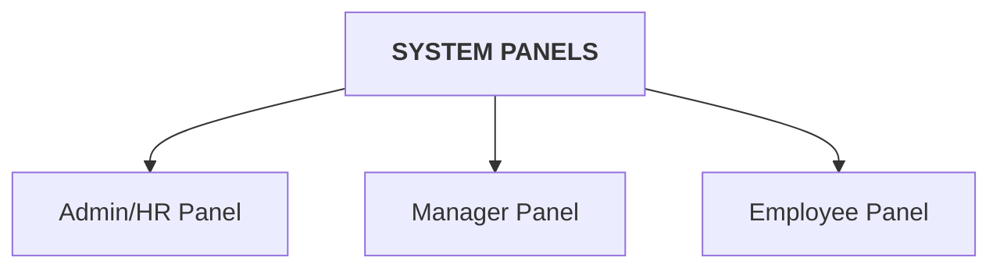

# Leave Management System - Leave Microservice

Welcome to the **Leave Microservice** of the Leave Management System. This service is responsible for managing leave types, public holidays, personal employee leave balances, applying for leaves, and executing complex leave approval workflows driven by the Flowable orchestration engine.

## System Panels & Architecture

Below is a visual representation of the capabilities divided among the three primary panels (Roles) supported by this microservice.

## Working flow :

### 1. Leave Flowable :

### 2. AI Chatbot Working Flow :

## Role Descriptions & Endpoints

### 1. ADMIN/HR Panel
Admins and HR professionals manage the leave configuration parameters, declared organization-wide holidays, employee leave quotas, and perform final evaluations of leave requests:
*   **Leave Types Configuration:** Configure, update, read, and delete different leave categories (e.g. Casual Leave, Sick Leave) along with their maximum day limits.
*   **Leave Balance Initialization:** Create and configure starting leave balances for newly onboarded employees.
*   **Public Holidays Management:** Build, modify, view, and delete public holiday entries for the organization's calendar.
*   **Task Review & Action:** Retrieve pending HR tasks, approve/reject requests, and handle partial leaves with detailed day-specific rejection remarks.
*   **Organizational History Overview:** Monitor the complete leave applications history for all organization employees.

**Admin/HR Endpoints:**
* `GET /leaves/get-leaves`
    * **Response:** `List<CreateLeaveResponse>` (id, leaveName, uniqueLeaveName, description, maxDays)

* `POST /leaves/create-leave`
    * **Request:** `CreateLeaveRequest` (leaveName, uniqueLeaveName, description, maxDays)
    * **Response:** `SuccessResponse` (message: "Leave created!")

* `PUT /leaves/update-leave`
    * **Request:** `CreateLeaveResponse` (id, leaveName, uniqueLeaveName, description, maxDays)
    * **Response:** `SuccessResponse` (message: "Leave updated!")

* `DELETE /leaves/delete-leave/{id}`
    * **Response:** `SuccessResponse` (message: "Leave deleted!")

* `POST /leaves/create-employee-leave`
    * **Request:** `EmployeeLeaveRequest` (userId, leaves [Map of leave type name to balance double])
    * **Response:** `SuccessResponse` (message: "Employee Leave record created!")

* `GET /hr/my-tasks`
    * **Header:** `Authorization: Bearer <token>`
    * **Response:** `List<HRTaskResponse>` (taskId, leaveId, employeeName, fromDate, toDate, leaveType, reason, dayDetails, trail)

* `POST /hr/action`
    * **Request:** `Map<String, Object>` (taskId, hrApproved, partialApprovedDayIds, rejectedDayReasons, rejectionReason)
    * **Response:** `void` (Status 200 OK)

* `GET /hr/emp-leave-history`
    * **Response:** `List<MyEmpLeaveHistory>` (leaveId, employeeEmail, managerEmail, leaveType, fromDate, toDate, createdAt, reason, status, approvedBy, rejectionReason, employeeName, trail)

* `POST /leaves/create-public-holiday`
    * **Request:** `PublicHolidayRequest` (holidayDate, festivalName)
    * **Response:** `SuccessResponse` (message: "Public Holiday created!")

* `PUT /leaves/update-public-holiday/{id}`
    * **Request:** `PublicHolidayRequest` (holidayDate, festivalName)
    * **Response:** `SuccessResponse` (message: "Public holiday updated successfully!")

* `DELETE /leaves/delete-public-holiday/{id}`
    * **Response:** `SuccessResponse` (message: "Public holiday deleted successfully!")

### 2. MANAGER Panel
Managers act as intermediate approvers for leave applications submitted by their subordinates:
*   **Subordinate Requests Monitoring:** Retrieve active leave applications submitted by team members waiting for manager evaluation.
*   **Approval & Rejection:** Approve leave requests to advance them to the HR verification stage, or reject them immediately with specific reasons.
*   **Subordinate History Logs:** View historical leave applications and audit trails for direct report employees.

**Manager Endpoints:**
* `GET /manager/my-tasks`
    * **Header:** `Authorization: Bearer <token>`
    * **Response:** `List<Map<String, Object>>` (Flowable task details)

* `POST /manager/action`
    * **Request:** `Map<String, Object>` (taskId, managerApproved, rejectionReason)
    * **Response:** `void` (Status 200 OK)

* `GET /manager/my-emp-leave-history`
    * **Header:** `Authorization: Bearer <token>`
    * **Response:** `List<MyEmpLeaveHistory>` (leaveId, employeeEmail, managerEmail, leaveType, fromDate, toDate, createdAt, reason, status, approvedBy, rejectionReason, employeeName, trail)

### 3. EMPLOYEE Panel
Employees use the microservice to apply for leave, monitor status, and review the calendar:
*   **Applying for Leave:** Register leave requests indicating leave types, date ranges, reasons, comments, and specific session properties per day (Full Day vs Half Day - Morning/Afternoon session).
*   **Balance Inquiries:** Query and track personal available balances for all leave types in real time.
*   **Requests Administration:** Retrieve personal leave request logs with audit trails, and delete pending requests before manager review.
*   **Calendar Tracking:** Check the listing of all official declared company public holidays.

**Employee Endpoints:**
* `POST /leaves/apply-leave`
    * **Request:** `ApplyLeaveRequest` (userId, emailId, managerId, managerEmail, fullName, managerName, leaveType, fromDate, toDate, reason, comments, dayDetails)
    * **Response:** `SuccessResponse` (message: "Leave Request Applied Successfully!")

* `GET /leaves/my-leaves`
    * **Header:** `Authorization: Bearer <token>`
    * **Response:** `List<ApplyLeaveResponse>` (id, leaveType, fromDate, toDate, emailId, reason, comments, status, editable, createdAt, approvedBy, rejectionReason, dayDetails, trail)

* `DELETE /leaves/my-leaves/{leaveId}`
    * **Header:** `Authorization: Bearer <token>`
    * **Response:** `SuccessResponse` (message: "Leave Request Deleted successfully")

* `GET /leaves/leave-balance`
    * **Header:** `Authorization: Bearer <token>`
    * **Response:** `Map<String, Double>` (Key: Leave type name, Value: Remaining balance)

* `GET /leaves/public-holidays`
    * **Response:** `List<PublicHolidayResponse>` (id, holidayDate, festivalName)

### 4. AI CHATBOT / SESSION INTEGRATION
Manage conversational chatbot sessions, queries, and contextual historical logs with the integrated AI assistant:
*   **Chat Logs Retrospective:** Fetch historical interactive chat titles and contents for user sessions.
*   **Messages Logging:** Log and batch-save questions, answers, and context strings linked to chatbot conversations.
*   **Conversations Modification:** Change chat session titles or delete entire interactive chat logs.

**Chatbot Endpoints:**
* `GET /chat/titles`
    * **Header:** `Authorization: Bearer <token>`
    * **Response:** `List<ChatDTO>` (chatId, title, userId, createdAt)

* `GET /chat/{chatId}`
    * **Header:** `Authorization: Bearer <token>`
    * **Response:** `List<MessageDTO>` (messageId, role, content, timestamp)

* `POST /chat/message/save`
    * **Request:** `ChatMessageSaveRequest` (chatId, role, content, title)
    * **Response:** `String` ("Message saved successfully")

* `POST /chat/messages/save-batch`
    * **Request:** `ChatMessageBatchSaveRequest` (chatId, messages, title)
    * **Response:** `String` ("Batch messages saved successfully")

* `PUT /chat-title/update`
    * **Request:** `EditChatTitleRequest` (chatId, title)
    * **Response:** `String` ("Chat title updated successfully")

* `DELETE /chat-title/delete/{chatId}`
    * **Response:** `String` ("Chat history deleted successfully")
